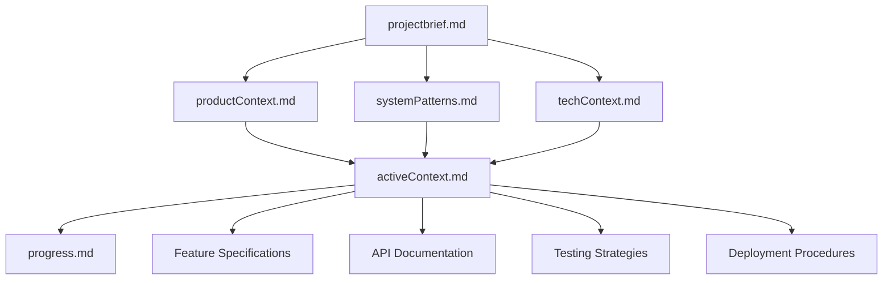

# Documentation and Memory Bank Strategy: Chaching Financial Management Application

## Documentation Philosophy

**Core Principle**: Documentation as Code - Living, versioned, and essential infrastructure  
**Purpose**: Ensure project continuity across memory resets and team changes  
**Standard**: Every feature, decision, and pattern must be documented immediately  
**Integration**: Documentation updates are integral to the Definition of Done

## Memory Bank Update Protocols

### Memory Bank File Hierarchy



### Update Trigger Events

#### Immediate Update Required
1. **New Feature Implementation**: Update progress.md and relevant memory bank files
2. **Architecture Changes**: Update systemPatterns.md and techContext.md
3. **User Story Completion**: Update progress.md with completion status
4. **Critical Decisions**: Update activeContext.md with decision rationale
5. **Risk Materialization**: Update all relevant files with impact assessment

#### Weekly Update Schedule
1. **Monday**: activeContext.md - Sprint goals and focus areas
2. **Wednesday**: progress.md - Mid-sprint progress assessment
3. **Friday**: All files review - End-of-sprint comprehensive update
4. **Sunday**: Strategic review - Roadmap and priority adjustments

#### Phase Completion Updates
1. **Phase Milestones**: Complete review of all memory bank files
2. **Architecture Evolution**: Document architectural changes and rationale
3. **Pattern Identification**: Update systemPatterns.md with new patterns
4. **Lessons Learned**: Document insights in activeContext.md

---

## Documentation Requirements by Phase

### Phase 1: Foundation Documentation (Weeks 1-4)

#### Database Documentation Requirements
**Files to Update**: `memory-bank/systemPatterns.md`, `memory-bank/techContext.md`

**Required Documentation:**
- Database schema with entity relationships
- Migration strategy and rollback procedures
- Performance optimization decisions
- Security implementation details
- Connection pooling and configuration

**Documentation Tasks:**
```markdown
## Database Schema Documentation
- Entity Relationship Diagrams (ERD)
- Table creation scripts with comments
- Index strategy and performance considerations
- Data migration procedures and validation
- Backup and recovery procedures

## Integration Documentation
- Connection string management
- Environment-specific configurations
- Database access patterns and best practices
- Performance monitoring and alerting setup
```

#### Authentication Documentation Requirements
**Files to Update**: `memory-bank/systemPatterns.md`, `memory-bank/progress.md`

**Required Documentation:**
- Authentication flow diagrams
- Security implementation decisions
- Session management strategy
- Integration with existing client context
- Security audit results and remediation

**Documentation Tasks:**
```markdown
## Authentication System Documentation
- OAuth/JWT implementation details
- Session management and expiration policies
- Password reset flow and security measures
- Integration points with existing client context
- Security testing results and compliance verification
```

### Phase 2: Core Features Documentation (Weeks 5-8)

#### AI Integration Documentation Requirements
**Files to Update**: `memory-bank/systemPatterns.md`, `memory-bank/progress.md`

**Required Documentation:**
- AI flow architecture and data flow
- Prompt engineering strategies and templates
- Performance optimization and caching strategies
- Error handling and fallback mechanisms
- Accuracy measurement and improvement processes

**Documentation Tasks:**
```markdown
## AI Integration Documentation
- Google Genkit flow configurations
- Data preprocessing and validation procedures
- AI response caching and optimization strategies
- Error handling and fallback mechanisms
- Performance metrics and accuracy tracking
```

#### Client Analytics Documentation Requirements
**Files to Update**: `memory-bank/systemPatterns.md`, `memory-bank/progress.md`

**Required Documentation:**
- Analytics calculation algorithms
- Data visualization component architecture
- Performance optimization for large datasets
- Search and filtering implementation details
- Caching strategies for client data

### Phase 3: Business Features Documentation (Weeks 9-12)

#### Invoice System Documentation Requirements
**Files to Update**: `memory-bank/systemPatterns.md`, `memory-bank/progress.md`

**Required Documentation:**
- PDF generation architecture and templates
- Payment tracking and reconciliation procedures
- Email integration and delivery tracking
- Tax calculation algorithms for Philippines
- Client portal security and access controls

#### Financial Planning Documentation Requirements
**Files to Update**: `memory-bank/systemPatterns.md`, `memory-bank/progress.md`

**Required Documentation:**
- Cash flow forecasting algorithms
- Tax calculation engine for Philippines regulations
- Report generation and export procedures
- Financial data accuracy validation
- Compliance and regulatory considerations

### Phase 4: Advanced Features Documentation (Weeks 13-16)

#### Automation Documentation Requirements
**Files to Update**: `memory-bank/systemPatterns.md`, `memory-bank/progress.md`

**Required Documentation:**
- Recurring invoice automation logic
- Background job scheduling and monitoring
- System performance optimization strategies
- User experience enhancements and accessibility
- Production deployment and monitoring procedures

---

## Memory Bank Update Procedures

### Daily Update Protocol

#### Developer Responsibilities
```markdown
## Daily Memory Bank Update Checklist

### Before Starting Work
- [ ] Read relevant memory bank files for context
- [ ] Review activeContext.md for current priorities
- [ ] Check progress.md for current status

### During Development
- [ ] Document architectural decisions immediately
- [ ] Update progress.md with completed tasks
- [ ] Note any blockers or risks in activeContext.md

### End of Day
- [ ] Update progress.md with work completed
- [ ] Document any new patterns in systemPatterns.md
- [ ] Update activeContext.md with tomorrow's priorities
```

#### Team Lead Responsibilities
```markdown
## Team Lead Daily Update Protocol

### Morning Review
- [ ] Review all team member updates from previous day
- [ ] Identify any missing documentation
- [ ] Update activeContext.md with team priorities

### Evening Synthesis
- [ ] Consolidate individual updates into comprehensive status
- [ ] Identify documentation gaps and assign owners
- [ ] Update risk assessments and mitigation strategies
```

### Weekly Comprehensive Review

#### Monday: Sprint Planning Documentation
```markdown
## Monday Memory Bank Update Protocol

### activeContext.md Updates
- Current sprint goals and objectives
- Task assignments and responsibilities
- Dependencies and blockers identification
- Risk assessment for the week

### progress.md Updates
- Previous week accomplishments
- Current sprint progress baseline
- Upcoming milestones and deliverables

### systemPatterns.md Updates
- Any architectural decisions from sprint planning
- New patterns or approaches to be implemented
- Integration considerations for new features
```

#### Wednesday: Mid-Sprint Assessment
```markdown
## Wednesday Memory Bank Update Protocol

### progress.md Updates
- Sprint progress assessment (percentage complete)
- Completed tasks and remaining work
- Any scope changes or adjustments

### activeContext.md Updates
- Mid-sprint blocker identification
- Resource reallocation decisions
- Risk mitigation actions taken

### Risk Documentation
- New risks identified
- Mitigation strategies implemented
- Impact assessment updates
```

#### Friday: Sprint Completion Review
```markdown
## Friday Memory Bank Update Protocol

### Comprehensive Review Process
1. **progress.md Complete Update**
   - All completed features documented
   - Quality metrics and performance results
   - Technical debt identification
   - Next sprint preparation notes

2. **systemPatterns.md Architecture Review**
   - New patterns implemented and validated
   - Architecture decisions and rationale
   - Integration points and dependencies
   - Performance optimization results

3. **activeContext.md Strategic Update**
   - Sprint retrospective insights
   - Next sprint strategic priorities
   - Team capacity and resource planning
   - Long-term goal progress assessment

4. **techContext.md Technology Updates**
   - New dependencies or tools added
   - Configuration changes and environment updates
   - Performance benchmarks and optimizations
   - Security updates and compliance changes
```

### Phase Completion Documentation Protocol

#### Phase Review Process
```markdown
## Phase Completion Memory Bank Update

### 1. Comprehensive File Review (2 hours)
**Objective**: Ensure all memory bank files accurately reflect current state

**Process**:
- [ ] Review projectbrief.md - Validate scope alignment
- [ ] Review productContext.md - Confirm user value delivery
- [ ] Review systemPatterns.md - Document all new patterns
- [ ] Review techContext.md - Update technology decisions
- [ ] Review activeContext.md - Phase transition planning
- [ ] Review progress.md - Complete phase accomplishments

### 2. Architecture Documentation Update (1 hour)
**Objective**: Document all architectural evolution

**Process**:
- [ ] Create architecture diagrams for new systems
- [ ] Document integration points and data flows
- [ ] Update component relationship diagrams
- [ ] Validate security and performance decisions

### 3. Knowledge Transfer Preparation (1 hour)
**Objective**: Ensure seamless knowledge transfer

**Process**:
- [ ] Document critical implementation details
- [ ] Create troubleshooting guides for new features
- [ ] Update API documentation and examples
- [ ] Prepare phase completion report
```

---

## Knowledge Transfer and Context Preservation

### Context Preservation Strategies

#### Critical Information Identification
```markdown
## Critical Information Categories

### Technical Context
- Architecture decisions and rationale
- Integration patterns and dependencies
- Performance optimization strategies
- Security implementation details
- Database schema and migration history

### Business Context
- Feature requirements and acceptance criteria
- User workflow and experience decisions
- Compliance and regulatory considerations
- Business rule implementation details
- Stakeholder communication and feedback

### Project Context
- Risk assessments and mitigation strategies
- Resource allocation and timeline decisions
- Quality metrics and performance benchmarks
- Team capacity and skill assessments
- Vendor and tool selection rationale
```

#### Documentation Quality Standards
```markdown
## Memory Bank Quality Standards

### Completeness Criteria
- [ ] All architectural decisions documented with rationale
- [ ] All features have acceptance criteria and status
- [ ] All risks identified with mitigation strategies
- [ ] All integrations documented with examples
- [ ] All performance benchmarks recorded

### Accuracy Standards
- [ ] Information verified against actual implementation
- [ ] Code examples tested and validated
- [ ] Links and references checked for accuracy
- [ ] Version information current and correct
- [ ] Contact information and responsibilities updated

### Accessibility Requirements
- [ ] Clear section headings and navigation
- [ ] Consistent formatting and structure
- [ ] Technical terms defined and explained
- [ ] Examples provided for complex concepts
- [ ] Cross-references between related information
```

### Team Knowledge Sharing

#### Daily Knowledge Sharing Protocol
```markdown
## Daily Team Knowledge Sharing

### Morning Standup Documentation
- [ ] Share yesterday's architectural discoveries
- [ ] Highlight any new patterns or approaches
- [ ] Identify knowledge gaps and learning needs
- [ ] Plan knowledge transfer sessions if needed

### End-of-Day Knowledge Capture
- [ ] Document solutions to technical challenges
- [ ] Share reusable code patterns and utilities
- [ ] Update troubleshooting documentation
- [ ] Prepare knowledge transfer for next day
```

#### Weekly Knowledge Consolidation
```markdown
## Weekly Knowledge Consolidation Protocol

### Team Learning Review
- [ ] Consolidate individual discoveries into team knowledge
- [ ] Identify best practices and anti-patterns
- [ ] Update coding standards and guidelines
- [ ] Plan team training on new technologies or approaches

### External Knowledge Integration
- [ ] Research industry best practices for implemented features
- [ ] Integrate external documentation and examples
- [ ] Update technology choices based on community feedback
- [ ] Plan exploration of new tools and approaches
```

---

## Documentation Automation and Tools

### Automated Documentation Generation

#### Code Documentation Integration
```markdown
## Automated Documentation Tools

### TypeScript Documentation
- TSDoc comments for all public APIs
- Automated API documentation generation
- Type definition exports and documentation
- Integration with existing documentation systems

### Component Documentation
- Storybook for UI component documentation
- Automated screenshot generation for visual regression
- Props documentation and usage examples
- Accessibility testing and documentation

### Database Documentation
- Automated schema diagram generation
- Entity relationship documentation
- Migration history and rollback procedures
- Performance monitoring and optimization guides
```

#### Documentation Validation
```markdown
## Documentation Quality Automation

### Validation Checks
- [ ] Link validation for all internal and external references
- [ ] Code example compilation and testing
- [ ] Markdown formatting and structure validation
- [ ] Spell checking and grammar validation
- [ ] Image and asset availability verification

### Continuous Integration
- [ ] Documentation builds as part of CI/CD pipeline
- [ ] Automated testing of code examples
- [ ] Performance testing of documented procedures
- [ ] Security scanning of documented configurations
- [ ] Accessibility testing of documentation websites
```

### Documentation Deployment and Access

#### Documentation Hosting Strategy
```markdown
## Documentation Deployment Strategy

### Internal Documentation
- Memory bank files maintained in project repository
- Automated deployment to internal documentation site
- Version control and change tracking
- Search functionality and cross-referencing

### Public Documentation
- User-facing documentation for public features
- API documentation for external integrations
- Developer guides for extension and customization
- Community contribution guidelines and processes
```

**Confidence Rating**: 9/10

This comprehensive documentation and memory bank strategy ensures that all project knowledge is preserved, accessible, and maintained throughout the development lifecycle, enabling seamless continuation of work across team changes and memory resets while maintaining the highest standards of project documentation.