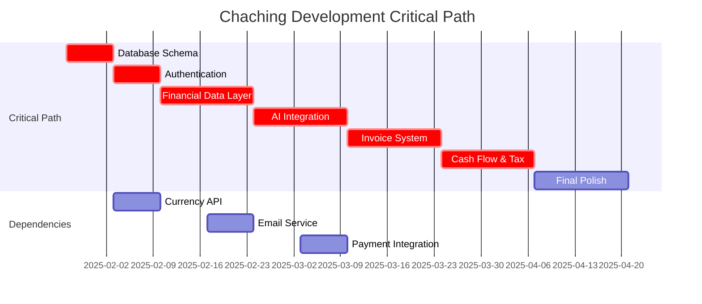

# Resource Allocation Plan: Chaching Financial Management Application

## Resource Planning Overview

**Planning Period**: 16 weeks (4 phases)  
**Project Scope**: Transform from 25% complete prototype to production-ready financial platform  
**Resource Focus**: Development efficiency, risk mitigation, quality assurance  
**Allocation Strategy**: Phase-based resource scaling with critical path optimization

## Timeline Estimates by Component

### Phase 1: Foundation & Data Layer (Weeks 1-4)

#### Database Infrastructure (Week 1)
**Estimated Effort**: 40 hours  
**Complexity**: High  
**Risk Level**: Medium

| Task | Estimated Hours | Skills Required | Priority |
|------|----------------|-----------------|----------|
| Database Schema Design | 8 hours | Database Architecture | Critical |
| Migration Scripts | 6 hours | SQL, TypeScript | Critical |
| Connection Configuration | 4 hours | DevOps, Configuration | Critical |
| Performance Optimization | 8 hours | Database Tuning | High |
| Backup Strategy Implementation | 6 hours | DevOps, Security | High |
| Documentation and Testing | 8 hours | Technical Writing | Medium |

#### Authentication System (Week 2)
**Estimated Effort**: 35 hours  
**Complexity**: High  
**Risk Level**: High

| Task | Estimated Hours | Skills Required | Priority |
|------|----------------|-----------------|----------|
| Authentication Provider Setup | 10 hours | Security, OAuth | Critical |
| User Registration Flow | 8 hours | Frontend, Backend | Critical |
| Login/Logout Implementation | 6 hours | Session Management | Critical |
| Password Reset System | 6 hours | Email Integration | High |
| Security Audit and Testing | 5 hours | Security Testing | High |

#### Financial Data Layer (Weeks 3-4)
**Estimated Effort**: 50 hours  
**Complexity**: Medium  
**Risk Level**: Medium

| Task | Estimated Hours | Skills Required | Priority |
|------|----------------|-----------------|----------|
| Transaction Models | 12 hours | TypeScript, ORM | Critical |
| Income/Expense CRUD | 15 hours | Full-stack Development | Critical |
| Multi-currency Integration | 10 hours | API Integration | Critical |
| Data Migration | 8 hours | Data Processing | High |
| Testing and Validation | 5 hours | QA Testing | High |

### Phase 2: Core Financial Features (Weeks 5-8)

#### Client Analytics Enhancement (Weeks 5-6)
**Estimated Effort**: 45 hours  
**Complexity**: Medium  
**Risk Level**: Low

| Task | Estimated Hours | Skills Required | Priority |
|------|----------------|-----------------|----------|
| Advanced Search Implementation | 12 hours | Frontend, Search Algorithms | High |
| Financial Analytics Dashboard | 20 hours | Data Visualization, React | Critical |
| Performance Optimization | 8 hours | Performance Tuning | Medium |
| User Experience Polish | 5 hours | UI/UX Design | Medium |

#### AI Integration (Weeks 7-8)
**Estimated Effort**: 40 hours  
**Complexity**: High  
**Risk Level**: Medium

| Task | Estimated Hours | Skills Required | Priority |
|------|----------------|-----------------|----------|
| AI Data Pipeline | 15 hours | AI/ML, Data Processing | Critical |
| Insights Dashboard | 12 hours | Frontend, Data Visualization | Critical |
| Prediction Algorithms | 10 hours | AI/ML, Statistical Analysis | High |
| Performance Optimization | 3 hours | AI Optimization | Medium |

### Phase 3: Business Operations (Weeks 9-12)

#### Invoice System (Weeks 9-10)
**Estimated Effort**: 55 hours  
**Complexity**: High  
**Risk Level**: Medium

| Task | Estimated Hours | Skills Required | Priority |
|------|----------------|-----------------|----------|
| Invoice Generation Engine | 20 hours | PDF Generation, Templates | Critical |
| Payment Tracking | 15 hours | Payment Processing, APIs | Critical |
| Client Portal | 12 hours | Frontend, Security | High |
| Email Integration | 8 hours | Email Services, Automation | High |

#### Financial Planning Tools (Weeks 11-12)
**Estimated Effort**: 50 hours  
**Complexity**: High  
**Risk Level**: Medium

| Task | Estimated Hours | Skills Required | Priority |
|------|----------------|-----------------|----------|
| Cash Flow Forecasting | 25 hours | Financial Algorithms, AI | Critical |
| Tax Calculation Engine | 15 hours | Tax Law, Calculations | Critical |
| Reporting System | 10 hours | Data Export, Formatting | High |

### Phase 4: Advanced Features (Weeks 13-16)

#### Automation & Polish (Weeks 13-16)
**Estimated Effort**: 35 hours  
**Complexity**: Medium  
**Risk Level**: Low

| Task | Estimated Hours | Skills Required | Priority |
|------|----------------|-----------------|----------|
| Recurring Invoice Automation | 15 hours | Background Jobs, Scheduling | Medium |
| System Optimization | 10 hours | Performance, Caching | Medium |
| User Experience Polish | 6 hours | UI/UX, Accessibility | Medium |
| Final Testing and Deployment | 4 hours | QA, DevOps | High |

---

## Critical Path Identification

### Primary Critical Path


### Critical Dependencies

#### Week 1: Database Foundation
**Blockers**: Database provider selection, schema design approval  
**Dependencies**: None (can start immediately)  
**Risk**: High - Foundation for all future work  
**Mitigation**: Prioritize schema review, have backup database options

#### Week 2: Authentication Integration
**Blockers**: Database completion, authentication provider setup  
**Dependencies**: Database schema (Week 1)  
**Risk**: High - Affects all user-related features  
**Mitigation**: Parallel development of auth components, staged rollout

#### Weeks 3-4: Financial Data Layer
**Blockers**: Authentication system, currency API selection  
**Dependencies**: Database (Week 1), Authentication (Week 2)  
**Risk**: Medium - Core business logic  
**Mitigation**: Mock data for development, API integration testing

#### Weeks 5-8: Core Features
**Blockers**: Financial data layer completion  
**Dependencies**: Completed data foundation  
**Risk**: Low - Builds on solid foundation  
**Mitigation**: Incremental feature rollout, continuous testing

### Risk Mitigation for Critical Path

#### Database Risk Mitigation
- **Primary Plan**: Firebase Firestore for rapid development
- **Backup Plan**: PostgreSQL with Prisma ORM
- **Contingency**: SQLite for development, cloud migration later
- **Timeline Buffer**: 3 days built into Week 1 schedule

#### Authentication Risk Mitigation
- **Primary Plan**: Firebase Authentication
- **Backup Plan**: NextAuth.js with custom providers
- **Contingency**: Simple JWT implementation for development
- **Timeline Buffer**: 2 days built into Week 2 schedule

#### Integration Risk Mitigation
- **API Dependencies**: Multiple provider options for each service
- **Performance Risks**: Load testing at each phase completion
- **Data Migration**: Comprehensive backup and rollback procedures
- **Timeline Buffer**: 1 week buffer built into overall timeline

---

## Resource Allocation Strategy

### Development Team Structure

#### Core Development Team (Full-time Equivalent)
- **Full-stack Developer**: 1.0 FTE - Primary development across all areas
- **TypeScript Specialist**: 0.5 FTE - Type safety, architecture, code review
- **UI/UX Developer**: 0.3 FTE - Design implementation, user experience
- **QA/Testing**: 0.2 FTE - Testing, quality assurance, documentation

#### Phase-Specific Resource Allocation

##### Phase 1: Infrastructure Heavy (Weeks 1-4)
```
Backend Development: 70% (28 hours/week)
Frontend Development: 20% (8 hours/week)
DevOps/Infrastructure: 10% (4 hours/week)
Total Weekly Effort: 40 hours
```

**Justification**: Foundation phase requires heavy backend work for database, authentication, and data layer establishment.

##### Phase 2: Balanced Development (Weeks 5-8)
```
Backend Development: 50% (20 hours/week)
Frontend Development: 40% (16 hours/week)
AI/ML Integration: 10% (4 hours/week)
Total Weekly Effort: 40 hours
```

**Justification**: Equal focus on backend analytics and frontend user experience with specialized AI work.

##### Phase 3: Business Logic Focus (Weeks 9-12)
```
Backend Development: 60% (24 hours/week)
Frontend Development: 30% (12 hours/week)
Integration/Testing: 10% (4 hours/week)
Total Weekly Effort: 40 hours
```

**Justification**: Complex business features like invoicing and financial planning require backend-heavy development.

##### Phase 4: Polish & Optimization (Weeks 13-16)
```
Frontend Development: 50% (20 hours/week)
Backend Optimization: 30% (12 hours/week)
Testing/QA: 20% (8 hours/week)
Total Weekly Effort: 40 hours
```

**Justification**: Final phase focuses on user experience, performance optimization, and comprehensive testing.

### Skill Requirements by Phase

#### Phase 1: Infrastructure Skills
- **Database Design**: PostgreSQL, Firebase Firestore, schema design
- **Authentication**: OAuth, JWT, session management, security best practices
- **TypeScript**: Advanced typing, strict mode, architectural patterns
- **DevOps**: Database deployment, environment configuration, CI/CD

#### Phase 2: Full-stack Skills
- **Data Visualization**: Recharts, Chart.js, statistical analysis
- **Search Implementation**: Search algorithms, indexing, performance
- **AI Integration**: Google Genkit, prompt engineering, data preprocessing
- **Performance Optimization**: Caching, query optimization, lazy loading

#### Phase 3: Business Domain Skills
- **PDF Generation**: React-PDF, template systems, document formatting
- **Financial Calculations**: Tax algorithms, currency conversion, forecasting
- **Email Integration**: Transactional emails, template systems, delivery
- **Payment Processing**: Stripe, PayPal, webhook handling

#### Phase 4: Optimization Skills
- **Performance Tuning**: Bundle optimization, caching strategies, CDN
- **User Experience**: Accessibility, mobile optimization, user testing
- **Quality Assurance**: End-to-end testing, performance testing, security audit
- **Deployment**: Production deployment, monitoring, maintenance

---

## Quality Gates & Review Checkpoints

### Weekly Quality Gates

#### Week 1: Database Foundation Gate
**Criteria for Progression:**
- [ ] Database schema designed and reviewed
- [ ] Migration scripts tested in development
- [ ] Connection configuration verified
- [ ] Performance benchmarks established
- [ ] Backup and recovery procedures tested

**Review Process:**
- Technical architecture review with schema validation
- Performance testing with realistic data volumes
- Security review of database access patterns
- Documentation review for completeness

#### Week 2: Authentication Security Gate
**Criteria for Progression:**
- [ ] Authentication flows fully functional
- [ ] Security audit completed with no critical issues
- [ ] Session management tested and verified
- [ ] Password reset flow tested end-to-end
- [ ] Integration with existing client context working

**Review Process:**
- Security penetration testing
- User experience testing of authentication flows
- Code review focusing on security best practices
- Performance testing under concurrent load

#### Weeks 3-4: Data Layer Integration Gate
**Criteria for Progression:**
- [ ] All financial data persists correctly
- [ ] Multi-currency conversion working accurately
- [ ] Client association with financial data functional
- [ ] Data migration from existing system successful
- [ ] API performance meets requirements

**Review Process:**
- Data integrity testing with various scenarios
- Currency conversion accuracy verification
- Performance testing with realistic data volumes
- User acceptance testing of core workflows

### Phase Completion Reviews

#### Phase 1 Completion Review (End Week 4)
**Success Criteria:**
- All foundational systems operational
- Security audit passed
- Performance benchmarks met
- Data persistence and retrieval working
- User authentication fully functional

**Review Format:**
- Technical demonstration of all foundation features
- Performance metrics review against targets
- Security audit report review
- Quality metrics assessment
- Risk assessment for Phase 2

#### Phase 2 Completion Review (End Week 8)
**Success Criteria:**
- Client analytics fully functional
- AI insights generating from real data
- Advanced search and filtering working
- Performance optimizations implemented
- User experience meets design standards

**Review Format:**
- Feature demonstration with real data
- AI accuracy and performance metrics review
- User experience testing results
- Performance benchmarks validation
- Preparation assessment for Phase 3

#### Phase 3 Completion Review (End Week 12)
**Success Criteria:**
- Invoice generation and tracking functional
- Cash flow forecasting operational
- Tax calculations accurate for Philippines
- Financial reporting system complete
- Integration testing passed

**Review Format:**
- Business workflow demonstrations
- Accuracy testing of financial calculations
- Performance testing under production load
- User acceptance testing results
- Production readiness assessment

#### Phase 4 Completion Review (End Week 16)
**Success Criteria:**
- All automation features working
- System performance optimized
- User experience polished
- Quality assurance completed
- Production deployment ready

**Review Format:**
- Complete system demonstration
- Performance and security final audit
- User acceptance and satisfaction testing
- Production deployment checklist review
- Post-launch support plan review

### Continuous Quality Monitoring

#### Daily Quality Metrics
- **Code Quality**: TypeScript strict mode compliance, ESLint scores
- **Test Coverage**: Unit test coverage percentage, integration test results
- **Performance**: Page load times, API response times, error rates
- **Security**: Automated security scanning results, vulnerability assessments

#### Weekly Quality Reviews
- **Code Review Completion**: Percentage of code reviewed before merge
- **Bug Rate**: Number of bugs per feature, bug resolution time
- **Performance Trends**: Week-over-week performance metrics
- **User Feedback**: Any user testing feedback or issues identified

#### Monthly Quality Assessments
- **Technical Debt**: Assessment of shortcuts taken, refactoring needs
- **Architecture Review**: Evaluation of architectural decisions and patterns
- **Security Review**: Comprehensive security assessment and improvements
- **Performance Optimization**: Identification of optimization opportunities

**Confidence Rating**: 9/10

This comprehensive resource allocation plan provides detailed timeline estimates, critical path identification, resource allocation strategies, and quality gates to ensure successful completion of the Chaching financial management application within the 16-week timeline while maintaining high quality standards.