# Sprint 2 Task 2: Financial Reports & Analytics System
## Complete Implementation Guide

**Document Version**: 1.0  
**Sprint**: Sprint 2, Task 2  
**Story Points**: 3 points  
**User Stories**: US-006 (Financial Reports) + US-007 (Dashboard Overview)  
**Status**: Ready for Implementation  
**Last Updated**: January 27, 2025

---

## 📋 **Executive Summary**

This implementation guide provides comprehensive technical specifications for building the Financial Reports & Analytics system for the Chaching platform. The system builds upon the excellent existing foundation (completed Transaction Management System) to deliver professional reporting capabilities and advanced dashboard analytics.

### **Key Objectives**
- ✅ Enhanced dashboard with 8 advanced KPI widgets
- ✅ Interactive chart system with multiple visualization types
- ✅ Professional PDF report generation
- ✅ CSV data export with custom filtering
- ✅ Real-time analytics integration

### **Implementation Strategy**
**Build upon existing excellence** rather than rebuild, leveraging:
- TransactionService (755 lines) - ✅ Complete
- TransactionContext (386 lines) - ✅ Complete  
- Dashboard Components (4 files) - ✅ Complete
- Real-time analytics infrastructure - ✅ Complete

---

## 🏗️ **System Architecture**

### **High-Level Architecture Diagram**

```mermaid
graph TB
    subgraph "Enhanced Dashboard Layer"
        EDL[Enhanced Dashboard Analytics]
        AKW[Advanced KPI Widgets]
        ICH[Interactive Charts]
        RGI[Report Generation Interface]
    end
    
    subgraph "Report Generation Engine"
        RPS[Report Processing Service]
        PDF[PDF Export Engine]
        CSV[CSV Export Engine]
        RTM[Report Templates Manager]
    end
    
    subgraph "Data Visualization Framework"
        ACH[Advanced Chart Types]
        IDD[Interactive Drill-Down]
        DTR[Date Range Picker]
        CFL[Custom Filters]
    end
    
    subgraph "Existing Foundation ✅"
        TS[TransactionService - 755 lines]
        TC[TransactionContext - 386 lines]
        TA[Transaction Analytics]
        DC[Dashboard Components - 4 files]
    end
    
    EDL --> TS
    AKW --> TC
    ICH --> TA
    RGI --> RPS
    RPS --> PDF
    RPS --> CSV
    RPS --> RTM
    ACH --> TA
    IDD --> TC
    DTR --> TS
    CFL --> TC
```



### **Component Integration Flow**


---

## 📁 **File Structure & Implementation Plan**

### **Complete File Structure**

```
src/
├── services/
│   ├── transaction.service.ts ✅ (Existing - 755 lines)
│   └── report.service.ts (NEW - ~400 lines)
├── components/dashboard/
│   ├── FinancialOverview.tsx ✅ (Enhance - +150 lines)
│   ├── RevenueChart.tsx ✅ (Enhance - +100 lines)
│   ├── RecentTransactions.tsx ✅ (Enhance - +50 lines)
│   ├── QuickActions.tsx ✅ (Enhance - +30 lines)
│   ├── AdvancedAnalytics.tsx (NEW - ~300 lines)
│   └── ReportGenerator.tsx (NEW - ~250 lines)
├── components/reports/
│   ├── ReportTemplates.tsx (NEW - ~200 lines)
│   ├── ExportModal.tsx (NEW - ~150 lines)
│   └── ChartSelector.tsx (NEW - ~100 lines)
├── utils/
│   ├── export.util.ts (NEW - ~150 lines)
│   ├── chart.util.ts (NEW - ~100 lines)
│   └── report.util.ts (NEW - ~200 lines)
├── types/
│   └── report.types.ts (NEW - ~100 lines)
└── app/(app)/reports/
    └── page.tsx (NEW - ~200 lines)
```

### **Implementation Phases**

#### **Phase 1: Enhanced Dashboard Analytics (1.5 points)**
**Timeline**: Days 1-3  
**Focus**: Enhance existing dashboard components with advanced analytics

1. **Enhanced Financial Overview** (Day 1)
   - Extend `FinancialOverview.tsx` (+150 lines)
   - Add 4 new advanced KPI widgets
   - Implement trend indicators and comparisons

2. **Interactive Chart System** (Day 2)
   - Enhance `RevenueChart.tsx` (+100 lines)
   - Add multiple chart types (pie, bar, area)
   - Implement drill-down functionality

3. **Advanced Analytics Component** (Day 3)
   - Create `AdvancedAnalytics.tsx` (300 lines)
   - Build comprehensive analytics dashboard
   - Integrate with existing transaction analytics

#### **Phase 2: Report Generation System (1.5 points)**
**Timeline**: Days 4-6  
**Focus**: Build professional report generation and export capabilities

4. **Report Service Layer** (Day 4)
   - Create `report.service.ts` (400 lines)
   - Implement PDF generation capabilities
   - Add CSV export functionality

5. **Report Generation Interface** (Day 5)
   - Create `ReportGenerator.tsx` (250 lines)
   - Build report templates system
   - Implement export modal interface

6. **Integration & Testing** (Day 6)
   - Complete integration with existing components
   - Add utility functions and type definitions
   - Comprehensive testing and optimization

---

## 🔧 **Technical Specifications**

### **1. Report Service Architecture**

```typescript
// src/services/report.service.ts

interface ReportService {
  // PDF Generation
  generatePDFReport(config: ReportConfig): Promise<Blob>;
  
  // CSV Export
  generateCSVExport(data: Transaction[], filters?: ReportFilters): Promise<string>;
  
  // Template Management
  getReportTemplates(): ReportTemplate[];
  createCustomReport(template: ReportTemplate, config: CustomConfig): Promise<Report>;
  
  // Analytics
  generateBusinessSummary(userId: string, dateRange: DateRange): Promise<BusinessSummary>;
  getClientProfitabilityReport(userId: string, clientId?: string): Promise<ClientReport>;
  getProfitLossStatement(userId: string, period: ReportPeriod): Promise<PLStatement>;
  getTaxReadyReport(userId: string, taxYear: number): Promise<TaxReport>;
}

interface ReportConfig {
  templateId: string;
  userId: string;
  dateRange: {
    startDate: Date;
    endDate: Date;
  };
  filters?: TransactionFilters;
  customization?: {
    includeLogo?: boolean;
    companyInfo?: UserBusinessInfo;
    currency?: CurrencyCode;
    theme?: 'light' | 'dark';
  };
}

interface ReportTemplate {
  id: string;
  name: string;
  description: string;
  category: 'financial' | 'client' | 'tax' | 'custom';
  format: 'pdf' | 'csv' | 'both';
  sections: ReportSection[];
  defaultConfig: Partial<ReportConfig>;
}
```

### **2. Enhanced Dashboard Components**

#### **Advanced Financial Overview**

```typescript
// Enhanced src/components/dashboard/FinancialOverview.tsx

interface AdvancedFinancialMetrics {
  // Existing metrics (enhanced)
  totalRevenue: MetricWithTrend;
  totalExpenses: MetricWithTrend;
  netProfit: MetricWithTrend;
  savingsRate: MetricWithTrend;
  
  // New advanced metrics
  profitMargin: MetricWithTrend;
  revenueGrowthRate: MetricWithTrend;
  clientAcquisitionRate: MetricWithTrend;
  averageTransactionValue: MetricWithTrend;
  cashFlowVelocity: MetricWithTrend;
  expenseRatio: MetricWithTrend;
  revenueConcentration: MetricWithTrend;
  paymentCollectionTime: MetricWithTrend;
}

interface MetricWithTrend {
  current: number;
  previous: number;
  change: number;
  changePercent: string;
  trend: 'up' | 'down' | 'neutral';
  color: 'green' | 'red' | 'gray';
  target?: number;
  targetStatus?: 'above' | 'below' | 'on-track';
}
```

---

## 📊 **Enhanced KPI System**

### **Business Intelligence Metrics**

```typescript
// src/utils/analytics.util.ts

interface BusinessMetrics {
  financial: {
    totalRevenue: number;
    netProfit: number;
    profitMargin: number;        // (Net Profit / Revenue) * 100
    revenueGrowthRate: number;   // ((Current - Previous) / Previous) * 100
    expenseRatio: number;        // (Expenses / Revenue) * 100
    cashFlowVelocity: number;    // Revenue / Average Collection Time
  };
  
  operational: {
    averageTransactionValue: number;     // Total Revenue / Transaction Count
    transactionFrequency: number;        // Transactions per month
    clientRetentionRate: number;         // Active clients retained period-over-period
    paymentCollectionTime: number;       // Average days to collect payment
    invoiceConversionRate: number;       // Paid invoices / Total invoices
  };
  
  growth: {
    monthOverMonthGrowth: number;        // Revenue growth MoM
    yearOverYearGrowth: number;          // Revenue growth YoY
    clientAcquisitionRate: number;       // New clients per month
    revenueConcentration: number;        // % revenue from top 3 clients
    marketDiversification: number;       // Number of active market segments
  };
  
  predictive: {
    projectedMonthlyRevenue: number;     // Based on current trends
    cashFlowForecast: number[];          // Next 6 months projection
    clientLifetimeValue: number;         // Average CLV across all clients
    seasonalityIndex: number;            // Seasonal variation factor
  };
}
```

---

## ✅ **Acceptance Criteria & Testing**

### **User Story Acceptance Criteria**

#### **US-006: Financial Reports (5 points)**

```markdown
**Acceptance Criteria:**
✅ Professional PDF report generation with multiple templates
  - P&L Statement with income/expense breakdown
  - Client Profitability Report with rankings
  - Tax-Ready Expense Report for Philippines compliance
  - Custom report builder with configurable sections

✅ CSV data export with custom filtering
  - Transaction data export with date range selection
  - Client data export with profitability metrics
  - Category-based export with tax classifications
  - Custom field selection for export

✅ Customizable date ranges and report parameters
  - Predefined ranges (last 30 days, quarter, year)
  - Custom date range picker
  - Client-specific filtering
  - Category and payment method filters

✅ Business-ready report formats
  - Professional PDF layouts with company branding
  - Print-friendly formatting
  - Digital sharing capabilities
  - Automated file naming conventions
```

#### **US-007: Dashboard Overview (5 points)**

```markdown
**Acceptance Criteria:**
✅ Enhanced KPI widgets with trend analysis
  - 8 advanced KPI widgets with trend indicators
  - Year-over-year and month-over-month comparisons
  - Performance alerts and threshold notifications
  - Interactive drill-down capabilities

✅ Interactive charts with drill-down capabilities
  - Multiple chart types (line, pie, bar, area, donut)
  - Time range selection and filtering
  - Cross-chart filtering and interaction
  - Responsive design for all screen sizes

✅ Real-time data updates
  - Live updates from transaction changes
  - Real-time KPI recalculation
  - Instant chart data refresh
  - Minimal loading states and smooth transitions

✅ Professional analytics interface
  - Consistent design with existing dashboard
  - Intuitive navigation and user flows
  - Accessible design following WCAG guidelines
  - Export capabilities integrated into interface
```

---

## 🛠️ **Implementation Checklist**

### **Pre-Implementation Setup**

- [ ] **Environment Verification**
  - [ ] Existing TransactionService functionality confirmed
  - [ ] Recharts library version compatibility checked
  - [ ] PDF generation library selection (react-pdf vs jsPDF)
  - [ ] Development environment configured

- [ ] **Dependency Installation**
  - [ ] PDF generation library installed
  - [ ] Additional chart type dependencies
  - [ ] File download utilities
  - [ ] Date/time manipulation libraries

### **Phase 1: Enhanced Dashboard Analytics**

- [ ] **Enhanced Financial Overview** (Day 1)
  - [ ] Add 4 new advanced KPI calculations
  - [ ] Implement trend indicators and comparisons
  - [ ] Add performance alerts and thresholds
  - [ ] Update component with new styling

- [ ] **Interactive Chart System** (Day 2)
  - [ ] Add pie chart implementation
  - [ ] Add bar chart implementation
  - [ ] Add area chart implementation
  - [ ] Implement chart type switching
  - [ ] Add drill-down functionality

- [ ] **Advanced Analytics Component** (Day 3)
  - [ ] Create comprehensive analytics dashboard
  - [ ] Implement client profitability analysis
  - [ ] Add category breakdown visualizations
  - [ ] Integrate with existing transaction analytics

### **Phase 2: Report Generation System**

- [ ] **Report Service Layer** (Day 4)
  - [ ] Implement PDF report generation
  - [ ] Implement CSV export functionality
  - [ ] Create report template system
  - [ ] Add data processing utilities

- [ ] **Report Generation Interface** (Day 5)
  - [ ] Create report generator modal
  - [ ] Implement template selection interface
  - [ ] Add customization options
  - [ ] Build export progress indicators

- [ ] **Integration & Testing** (Day 6)
  - [ ] Complete integration with existing components
  - [ ] Add comprehensive error handling
  - [ ] Implement performance optimizations
  - [ ] Complete testing and documentation

### **Quality Assurance**

- [ ] **Testing**
  - [ ] Unit tests for all new services
  - [ ] Integration tests for report generation
  - [ ] E2E tests for complete workflows
  - [ ] Performance testing with large datasets

- [ ] **Documentation**
  - [ ] Update memory bank with new patterns
  - [ ] Document API interfaces
  - [ ] Create user guide documentation
  - [ ] Update changelog with completed features

---

## 🎯 **Final Implementation Notes**

### **Critical Success Factors**

1. **Build Upon Excellence**: Leverage the robust existing Transaction Management System
2. **Maintain Consistency**: Follow established patterns and design principles
3. **Performance Focus**: Optimize for large datasets and real-time updates
4. **User Experience**: Ensure intuitive, professional interfaces
5. **Documentation**: Maintain comprehensive documentation for future continuity

### **Risk Mitigation**

1. **Technical Risks**
   - **Mitigation**: Thorough testing with realistic data volumes
   - **Fallback**: Graceful degradation for large datasets
   - **Monitoring**: Performance monitoring and alerting

2. **Integration Risks**
   - **Mitigation**: Incremental integration with existing components
   - **Testing**: Comprehensive integration testing
   - **Rollback**: Ability to disable new features if issues arise

3. **User Experience Risks**
   - **Mitigation**: Consistent design patterns and user flows
   - **Validation**: User testing and feedback incorporation
   - **Support**: Clear error messages and help documentation

### **Confidence Rating: 9/10**

This implementation guide provides a comprehensive roadmap for building a professional Financial Reports & Analytics system. The approach leverages existing excellence while delivering significant business value for freelancers and consultants using the Chaching platform.

---

**Document Status**: ✅ Ready for Implementation  
**Next Steps**: Switch to implementation mode and begin Phase 1 development  
**Contact**: Reference this document for all implementation decisions and architectural guidance