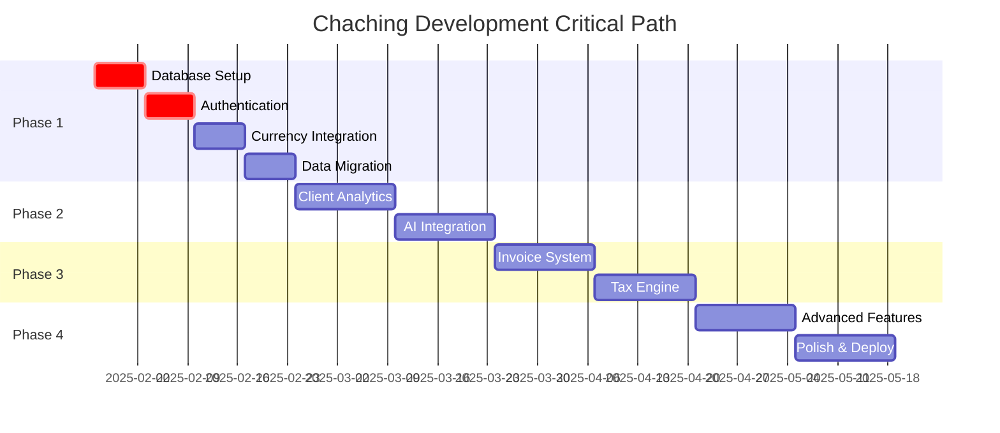

# Strategic Development Roadmap: Chaching Financial Management Application

## Executive Summary

**Project**: Chaching AI-Powered Financial Management Platform  
**Current Status**: 25% Complete (Foundation established)  
**Target Timeline**: 16 weeks (4 phases)  
**Total Story Points**: 147 points  
**Primary Goal**: Transform from prototype to production-ready financial management platform

## Project Overview

### Current State Analysis
- **Working**: Dashboard, Client Management, AI Flows, UI System (25% complete)
- **Critical Gaps**: No data persistence, no authentication, static exchange rates
- **Architecture**: Solid Next.js 15.2.3 + TypeScript + Google Genkit foundation
- **Quality**: Strong TypeScript patterns, comprehensive UI library, professional design

### Strategic Objectives
1. **Foundation Completion**: Implement data persistence and authentication
2. **Core Feature Development**: Complete income/expense tracking with AI integration
3. **Business Feature Implementation**: Invoice generation, tax planning, analytics
4. **Advanced Capabilities**: Payment processing, document management, forecasting

## Phase-Based Development Strategy

### Phase 1: Foundation & Data Layer (Weeks 1-4)
**Theme**: "Establish Persistent Foundation"  
**Priority**: Critical Infrastructure  
**Story Points**: 23 points

#### Key Milestones
- Database integration with persistent storage
- User authentication and session management
- Multi-currency transaction system
- Real-time exchange rate integration

#### Success Criteria
- All user data persists between sessions
- Secure user authentication with session management
- Accurate multi-currency support with live exchange rates
- Migration path from current in-memory data

#### Deliverables
- Production-ready database schema
- Authentication system with user profiles
- Enhanced income/expense tracking with persistence
- Real-time currency conversion API integration

---

### Phase 2: Core Financial Features (Weeks 5-8)
**Theme**: "Complete Financial Tracking Core"  
**Priority**: Essential Business Features  
**Story Points**: 24 points

#### Key Milestones
- Enhanced client management with financial analytics
- AI-powered insights connected to real data
- Advanced search and filtering capabilities
- Income prediction and financial forecasting

#### Success Criteria
- Complete client financial relationship tracking
- AI insights generate actionable recommendations
- Advanced client search and analytics
- Accurate income predictions based on historical data

#### Deliverables
- Client financial analytics dashboard
- Real-time AI financial insights
- Enhanced client search and filtering
- AI-powered income prediction system

---

### Phase 3: Business Operations (Weeks 9-12)
**Theme**: "Professional Business Management"  
**Priority**: Business Critical Features  
**Story Points**: 26 points

#### Key Milestones
- Professional invoice generation and tracking
- Cash flow forecasting and planning
- Automated tax estimation and planning
- Comprehensive financial reporting

#### Success Criteria
- Professional invoice creation with PDF generation
- Accurate cash flow predictions with scenario planning
- Automated tax calculations for Philippines freelancers
- Export-ready financial reports for accounting

#### Deliverables
- Complete invoicing system with payment tracking
- Cash flow forecasting dashboard
- Philippines tax estimation engine
- Professional financial report generation

---

### Phase 4: Advanced Features & Polish (Weeks 13-16)
**Theme**: "Advanced Capabilities & Optimization"  
**Priority**: Value-Add Features  
**Story Points**: 20 points

#### Key Milestones
- Recurring invoice automation
- Financial goal setting and tracking
- Advanced analytics and anomaly detection
- Performance optimization and polish

#### Success Criteria
- Automated recurring billing for retainer clients
- Goal tracking with progress visualization
- AI-powered spending anomaly alerts
- Optimized performance and user experience

#### Deliverables
- Recurring invoice automation system
- Goal management and tracking dashboard
- Anomaly detection and alerting system
- Performance-optimized production application

## Risk Assessment & Mitigation

### High-Risk Areas

#### 1. Database Migration Complexity
**Risk**: Data loss during migration from in-memory to persistent storage  
**Impact**: High - Loss of development progress and test data  
**Probability**: Medium  
**Mitigation**: 
- Implement comprehensive backup strategy
- Create migration scripts with rollback capability
- Test migration process in isolated environment
- Maintain parallel data systems during transition

#### 2. Authentication Integration Complexity
**Risk**: Breaking existing client context and state management  
**Impact**: High - Major refactoring required  
**Probability**: Medium  
**Mitigation**:
- Implement authentication alongside existing context system
- Gradual migration of state management to authenticated model
- Maintain backward compatibility during transition
- Comprehensive testing of context integration

#### 3. AI Performance with Real Data
**Risk**: AI flows perform poorly with production data volumes  
**Impact**: Medium - User experience degradation  
**Probability**: Medium  
**Mitigation**:
- Performance testing with realistic data volumes
- Implement caching strategies for AI responses
- Add fallback mechanisms for AI service unavailability
- Monitor and optimize AI response times

### Medium-Risk Areas

#### 4. Currency API Reliability
**Risk**: Exchange rate API service disruption or rate limiting  
**Impact**: Medium - Inaccurate currency conversions  
**Probability**: Low  
**Mitigation**:
- Implement multiple currency API providers
- Cache exchange rates with reasonable TTL
- Fallback to last known rates during API outages
- Monitor API usage and implement rate limiting

#### 5. Philippines Tax Regulation Complexity
**Risk**: Incorrect tax calculations due to complex regulations  
**Impact**: High - Financial compliance issues for users  
**Probability**: Low  
**Mitigation**:
- Consult with Philippines tax professionals
- Implement conservative tax estimation
- Add disclaimers about professional tax advice
- Regular updates for tax regulation changes

## Quality Gates & Review Checkpoints

### Phase Completion Criteria

#### Technical Quality Gates
1. **Code Quality**: TypeScript strict mode compliance, ESLint passing
2. **Performance**: Page load times < 2 seconds, AI responses < 5 seconds
3. **Security**: Authentication security audit, data encryption verification
4. **Testing**: Unit test coverage > 80%, integration tests passing
5. **Documentation**: Updated memory bank files, API documentation

#### User Experience Gates
1. **Mobile Responsiveness**: All features work on mobile devices
2. **Accessibility**: WCAG AA compliance verification
3. **Error Handling**: Graceful error states and user feedback
4. **Loading States**: Appropriate loading indicators and skeleton states
5. **Data Integrity**: No data loss scenarios in user workflows

### Weekly Review Process
- **Monday**: Sprint planning and task assignment
- **Wednesday**: Mid-sprint progress review and blocker identification
- **Friday**: Sprint completion review and next week planning
- **Memory Bank Update**: After each major feature completion

## Resource Allocation Strategy

### Development Focus Areas

#### Weeks 1-4: Infrastructure Heavy (70% Backend, 30% Frontend)
- Database design and implementation
- Authentication system development
- API integration for currency services
- Data migration and testing

#### Weeks 5-8: Feature Development (50% Backend, 50% Frontend)
- Client analytics implementation
- AI integration with real data
- Enhanced UI for client management
- Search and filtering systems

#### Weeks 9-12: Business Logic (60% Backend, 40% Frontend)
- Invoice generation system
- Tax calculation engine
- Cash flow forecasting algorithms
- Report generation and export

#### Weeks 13-16: Polish and Optimization (30% Backend, 70% Frontend)
- User experience improvements
- Performance optimization
- Advanced UI features
- Final testing and deployment preparation

### Critical Path Dependencies

## Success Metrics & KPIs

### Development Progress Metrics
- **Story Points Completion**: Target 9-10 points per week
- **Feature Completion Rate**: 100% of planned features per phase
- **Quality Metrics**: Zero critical bugs, TypeScript compliance
- **Performance Benchmarks**: Sub-2-second page loads

### Business Value Metrics
- **User Workflow Completion**: Complete financial tracking workflow
- **AI Accuracy**: >85% accuracy for income predictions
- **Data Integrity**: Zero data loss incidents
- **User Experience**: Professional-grade interface matching design specifications

### Technical Debt Management
- **Code Quality**: Maintain 9/10 quality rating
- **Documentation Coverage**: 100% memory bank accuracy
- **Testing Coverage**: >80% unit test coverage
- **Performance Optimization**: Continuous monitoring and improvement

**Confidence Rating**: 9/10

This strategic roadmap provides a clear path from the current 25% complete state to a fully functional financial management platform, with realistic timelines, proper risk management, and quality assurance throughout the development process.