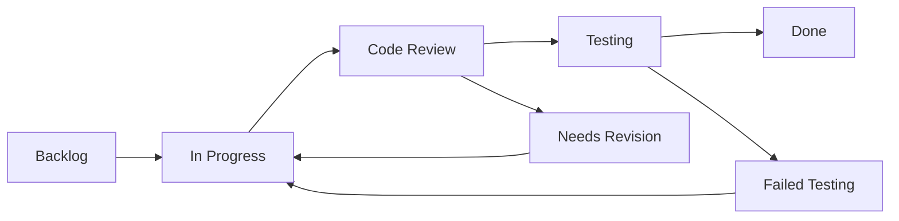

# Task Management Framework: Chaching Financial Management Application

## Framework Overview

**Purpose**: Standardize task creation, execution, and completion across different work types  
**Scope**: Infrastructure, Features, AI Integration, UI/UX Development  
**Standards**: Consistent templates, acceptance criteria, and progress tracking  
**Integration**: Aligns with sprint planning and memory bank documentation

## Task Classification System

### Work Type Categories

#### 1. Infrastructure Tasks
**Definition**: Backend systems, database, authentication, API development  
**Characteristics**: High technical complexity, system-wide impact, foundational  
**Examples**: Database setup, authentication system, API endpoints, security implementation

#### 2. Feature Development Tasks
**Definition**: User-facing functionality and business logic implementation  
**Characteristics**: Direct user value, moderate complexity, feature-specific  
**Examples**: Income tracking, client management, invoice generation, reporting

#### 3. AI Integration Tasks
**Definition**: Machine learning, AI flows, data processing, intelligent features  
**Characteristics**: Specialized knowledge, data-dependent, performance-sensitive  
**Examples**: Financial insights, income prediction, anomaly detection, AI flows

#### 4. UI/UX Tasks
**Definition**: User interface design, user experience optimization, responsive design  
**Characteristics**: Visual design focus, user interaction, accessibility  
**Examples**: Component styling, responsive layouts, user workflows, accessibility

---

## Task Templates by Work Type

### Infrastructure Task Template

```markdown
# Infrastructure Task: [Task Title]

## Task Classification
- **Work Type**: Infrastructure
- **Priority**: [High/Medium/Low]
- **Story Points**: [1-8]
- **Sprint**: [Sprint Number]
- **Dependencies**: [List dependent tasks/systems]

## Technical Requirements
- **System Impact**: [Areas affected by this change]
- **Performance Requirements**: [Response time, throughput, etc.]
- **Security Considerations**: [Authentication, authorization, data protection]
- **Scalability Requirements**: [Expected load, growth patterns]

## Implementation Details
- **Technology Stack**: [Specific technologies to use]
- **Database Changes**: [Schema modifications, migrations needed]
- **API Endpoints**: [New endpoints or modifications]
- **Configuration**: [Environment variables, settings]

## File Management Standards
- **Folder Structure**: 
  - Services: `src/services/[feature].service.ts`
  - Models: `src/models/[entity].model.ts`
  - Middleware: `src/middleware/[purpose].middleware.ts`
  - Utils: `src/utils/[category].util.ts`
- **Naming Conventions**: PascalCase for classes, camelCase for functions
- **Documentation**: Update memory bank files affected

## Acceptance Criteria
- [ ] **Functionality**: Core infrastructure works as specified
- [ ] **Performance**: Meets performance requirements
- [ ] **Security**: Security audit passed
- [ ] **Testing**: Unit tests >80% coverage, integration tests pass
- [ ] **Documentation**: Technical documentation updated
- [ ] **Memory Bank**: Relevant memory bank files updated

## Testing Requirements
- [ ] Unit tests for all new functions/methods
- [ ] Integration tests for API endpoints
- [ ] Security testing for authentication/authorization
- [ ] Performance testing under expected load
- [ ] Error handling and edge case testing

## Rollback Plan
- **Backup Strategy**: [How to backup current state]
- **Rollback Steps**: [Step-by-step rollback procedure]
- **Recovery Time**: [Expected time to restore service]
- **Data Recovery**: [How to recover any affected data]
```

### Feature Development Task Template

```markdown
# Feature Task: [Feature Name]

## Task Classification
- **Work Type**: Feature Development
- **Priority**: [High/Medium/Low]
- **Story Points**: [1-8]
- **Sprint**: [Sprint Number]
- **User Story**: [Reference to user story ID]

## Business Requirements
- **User Value**: [What value this provides to users]
- **Success Metrics**: [How success will be measured]
- **Business Rules**: [Any business logic constraints]
- **Workflow Impact**: [How this affects user workflows]

## Feature Specifications
- **Input Requirements**: [What data/input is needed]
- **Output/Results**: [What the feature produces]
- **Integration Points**: [Other systems/features it connects to]
- **Edge Cases**: [Unusual scenarios to handle]

## File Organization
- **Components**: `src/components/features/[feature-name]/`
- **Pages**: `src/app/(app)/[feature-name]/page.tsx`
- **Contexts**: `src/contexts/[Feature]Context.tsx`
- **Hooks**: `src/hooks/use-[feature-name].tsx`
- **Types**: Define in component files or shared types

## User Experience Requirements
- **User Interface**: [Description of UI requirements]
- **User Interactions**: [How users will interact with feature]
- **Responsive Design**: [Mobile/tablet considerations]
- **Accessibility**: [WCAG compliance requirements]
- **Error Handling**: [User-friendly error messages]

## Acceptance Criteria
- [ ] **User Story Completion**: All acceptance criteria met
- [ ] **UI/UX Standards**: Follows design system consistently
- [ ] **Responsive Design**: Works on mobile, tablet, desktop
- [ ] **Accessibility**: WCAG AA compliance verified
- [ ] **Performance**: Feature loads within 2 seconds
- [ ] **Integration**: Works with existing features seamlessly
- [ ] **Error Handling**: Graceful error states implemented
- [ ] **Testing**: Feature tested by real users

## Integration Requirements
- [ ] **Database Integration**: Data persistence working
- [ ] **API Integration**: All required API calls functional
- [ ] **Context Integration**: Properly integrated with React contexts
- [ ] **Authentication**: Respects user authentication state
- [ ] **Navigation**: Integrated with app navigation system
```

### AI Integration Task Template

```markdown
# AI Task: [AI Feature Name]

## Task Classification
- **Work Type**: AI Integration
- **Priority**: [High/Medium/Low]
- **Story Points**: [1-8]
- **Sprint**: [Sprint Number]
- **AI Flow**: [Reference to specific AI flow]

## AI Requirements
- **Model/Service**: [Gemini 2.0 Flash, custom model, etc.]
- **Input Data**: [What data the AI needs]
- **Output Format**: [Expected AI response format]
- **Performance Requirements**: [Response time, accuracy targets]
- **Fallback Strategy**: [What happens if AI fails]

## Data Requirements
- **Training Data**: [What data is needed for training/fine-tuning]
- **Real-time Data**: [Live data sources needed]
- **Data Preprocessing**: [How data should be prepared]
- **Data Validation**: [Input/output validation requirements]

## File Structure Standards
- **AI Flows**: `src/ai/flows/[flow-name].ts`
- **Prompts**: Define within flow files using structured schemas
- **Schemas**: Zod schemas for input/output validation
- **Utils**: `src/ai/utils/[purpose].util.ts`

## Performance Standards
- **Response Time**: [Maximum acceptable response time]
- **Accuracy**: [Minimum accuracy requirements]
- **Reliability**: [Uptime and error rate requirements]
- **Scalability**: [Concurrent request handling]

## Acceptance Criteria
- [ ] **AI Accuracy**: Meets minimum accuracy requirements
- [ ] **Performance**: Response time within acceptable limits
- [ ] **Integration**: AI flow integrated with application data
- [ ] **Error Handling**: Graceful fallback when AI unavailable
- [ ] **Schema Validation**: All inputs/outputs properly validated
- [ ] **User Experience**: AI results presented clearly
- [ ] **Testing**: AI behavior tested with various inputs
- [ ] **Documentation**: AI flow documented for future reference

## Monitoring & Optimization
- [ ] **Usage Tracking**: Monitor AI API usage and costs
- [ ] **Performance Monitoring**: Track response times and errors
- [ ] **Accuracy Monitoring**: Measure and track AI accuracy
- [ ] **Cost Optimization**: Implement caching where appropriate
- [ ] **Feedback Loop**: Mechanism to improve AI over time
```

### UI/UX Task Template

```markdown
# UI/UX Task: [Component/Feature Name]

## Task Classification
- **Work Type**: UI/UX Development
- **Priority**: [High/Medium/Low]
- **Story Points**: [1-8]
- **Sprint**: [Sprint Number]
- **Design Reference**: [Link to design files/mockups]

## Design Requirements
- **Visual Design**: [Specific design requirements]
- **Interaction Design**: [How users interact with the component]
- **Responsive Behavior**: [How it adapts to different screen sizes]
- **Animation/Transitions**: [Any motion design requirements]
- **Accessibility**: [Specific accessibility requirements]

## Component Structure
- **Component Location**: `src/components/ui/[component-name].tsx`
- **Feature Components**: `src/components/features/[feature]/[component].tsx`
- **Styling**: Tailwind CSS classes, CSS variables for theming
- **Variants**: Use Class Variance Authority for component variants

## Design System Standards
- **Colors**: Use CSS variables from theme system
- **Typography**: Follow established type scale
- **Spacing**: Use Tailwind spacing utilities
- **Shadows**: Consistent shadow system
- **Border Radius**: Consistent radius values

## Accessibility Requirements
- **Keyboard Navigation**: Full keyboard accessibility
- **Screen Reader**: Proper ARIA labels and descriptions
- **Color Contrast**: WCAG AA contrast ratios
- **Focus Management**: Clear focus indicators
- **Alternative Text**: Descriptive alt text for images

## Acceptance Criteria
- [ ] **Visual Design**: Matches approved design specifications
- [ ] **Responsive**: Works correctly on all device sizes
- [ ] **Accessibility**: WCAG AA compliance verified
- [ ] **Performance**: No performance impact on page load
- [ ] **Browser Compatibility**: Works in all target browsers
- [ ] **Design System**: Consistent with existing components
- [ ] **Documentation**: Component documented with examples
- [ ] **Testing**: Visual regression tests pass

## Browser Testing Requirements
- [ ] **Chrome**: Latest stable version
- [ ] **Firefox**: Latest stable version
- [ ] **Safari**: Latest stable version (macOS/iOS)
- [ ] **Edge**: Latest stable version
- [ ] **Mobile**: iOS Safari, Android Chrome
```

---

## Progress Tracking Mechanisms

### Task Status Workflow



### Status Definitions

#### Backlog
- Task is defined and ready for development
- All dependencies are identified
- Acceptance criteria are clear and complete
- Assigned to specific sprint or future planning

#### In Progress
- Developer has started working on the task
- Regular updates provided in daily standups
- Blockers identified and escalated promptly
- Progress tracked against estimated completion

#### Code Review
- Implementation is complete
- Code follows project standards and conventions
- Pull request created with proper description
- Awaiting peer review and approval

#### Testing
- Code review approved and merged
- Feature deployed to testing environment
- Acceptance criteria being verified
- User testing and feedback collection

#### Done
- All acceptance criteria met and verified
- Testing completed successfully
- Feature deployed to production
- Documentation updated and memory bank refreshed

### Progress Metrics

#### Individual Task Metrics
- **Cycle Time**: Time from "In Progress" to "Done"
- **Lead Time**: Time from "Backlog" to "Done"
- **Rework Rate**: Percentage of tasks requiring revision
- **Quality Score**: Percentage of acceptance criteria met on first attempt

#### Sprint-Level Metrics
- **Velocity**: Story points completed per sprint
- **Burndown**: Daily progress toward sprint goal
- **Scope Creep**: Unplanned work added during sprint
- **Team Capacity**: Actual vs. planned capacity utilization

#### Quality Metrics
- **Defect Rate**: Bugs found per story point
- **Test Coverage**: Percentage of code covered by tests
- **Performance Score**: Meeting performance acceptance criteria
- **User Satisfaction**: Feedback scores on completed features

### Daily Progress Tracking

#### Daily Standup Format
```markdown
## Daily Standup: [Date]

### [Developer Name]
**Yesterday Completed:**
- [Task ID]: [Brief description] - [Status change]
- [Any completed subtasks or milestones]

**Today's Plan:**
- [Task ID]: [Specific work planned]
- [Expected progress or completion targets]

**Blockers/Dependencies:**
- [Any impediments to progress]
- [Dependencies on other team members]
- [External dependencies or waiting items]

**Help Needed:**
- [Specific assistance requests]
- [Knowledge sharing opportunities]
```

#### Weekly Progress Review
```markdown
## Weekly Progress Review: [Week of Date]

### Sprint Goal Progress
- **Target**: [Sprint goal description]
- **Progress**: [X% complete / On track / Behind / Ahead]
- **Key Achievements**: [Major completions this week]

### Story Points Tracking
- **Planned**: [X points]
- **Completed**: [Y points]
- **Remaining**: [Z points]
- **Velocity**: [Points per day average]

### Quality Metrics
- **Tests Added**: [Number of new tests]
- **Code Coverage**: [Current percentage]
- **Bugs Found**: [Number and severity]
- **Performance Issues**: [Any performance concerns]

### Risks and Issues
- **Current Blockers**: [Active impediments]
- **Upcoming Risks**: [Potential issues next week]
- **Mitigation Actions**: [Steps being taken]

### Next Week Planning
- **Priority Tasks**: [Most important work]
- **Dependencies**: [Cross-team or external dependencies]
- **Resource Needs**: [Any additional resources needed]
```

---

## Review and Testing Processes

### Code Review Standards

#### Review Checklist
- [ ] **Code Quality**: Follows TypeScript strict mode standards
- [ ] **Architecture**: Consistent with established patterns
- [ ] **Performance**: No obvious performance issues
- [ ] **Security**: No security vulnerabilities introduced
- [ ] **Testing**: Adequate test coverage included
- [ ] **Documentation**: Code is well-documented
- [ ] **File Organization**: Files placed in correct directories
- [ ] **Naming Conventions**: Consistent naming throughout

#### Review Process
1. **Self Review**: Developer reviews own code before requesting review
2. **Peer Review**: At least one team member reviews the code
3. **Technical Review**: Senior developer reviews for architecture consistency
4. **Final Approval**: Product owner approves feature functionality

### Testing Strategy

#### Test Types by Task Category

##### Infrastructure Testing
- **Unit Tests**: Individual function and method testing
- **Integration Tests**: API endpoint and database interaction testing
- **Security Tests**: Authentication and authorization testing
- **Performance Tests**: Load testing and response time verification
- **End-to-End Tests**: Complete workflow testing

##### Feature Testing
- **Component Tests**: Individual React component testing
- **Integration Tests**: Feature integration with existing system
- **User Acceptance Tests**: Real user workflow testing
- **Accessibility Tests**: Screen reader and keyboard navigation
- **Browser Tests**: Cross-browser compatibility testing

##### AI Testing
- **Model Tests**: AI accuracy and performance testing
- **Data Tests**: Input validation and output verification
- **Integration Tests**: AI flow integration with application
- **Fallback Tests**: Behavior when AI services unavailable
- **Performance Tests**: Response time and throughput testing

##### UI/UX Testing
- **Visual Tests**: Design specification compliance
- **Interaction Tests**: User interface behavior testing
- **Responsive Tests**: Multi-device and screen size testing
- **Accessibility Tests**: WCAG compliance verification
- **Performance Tests**: Page load and rendering performance

### Quality Assurance Process

#### Pre-Development QA
- [ ] **Requirements Review**: Clear and testable requirements
- [ ] **Design Review**: UI/UX designs meet standards
- [ ] **Technical Review**: Architecture and approach validated
- [ ] **Dependency Check**: All dependencies available and compatible

#### Development QA
- [ ] **Code Standards**: Automated linting and formatting
- [ ] **Test Coverage**: Minimum 80% test coverage maintained
- [ ] **Performance Monitoring**: No performance regressions
- [ ] **Security Scanning**: Automated security vulnerability scanning

#### Post-Development QA
- [ ] **Feature Testing**: All acceptance criteria verified
- [ ] **Integration Testing**: Feature works with existing system
- [ ] **User Testing**: Real user feedback collected
- [ ] **Performance Validation**: Performance requirements met
- [ ] **Documentation Review**: All documentation updated

**Confidence Rating**: 9/10

This comprehensive task management framework provides structured templates and processes for managing different types of work effectively across the Chaching development project, ensuring consistent quality and progress tracking throughout the development lifecycle.