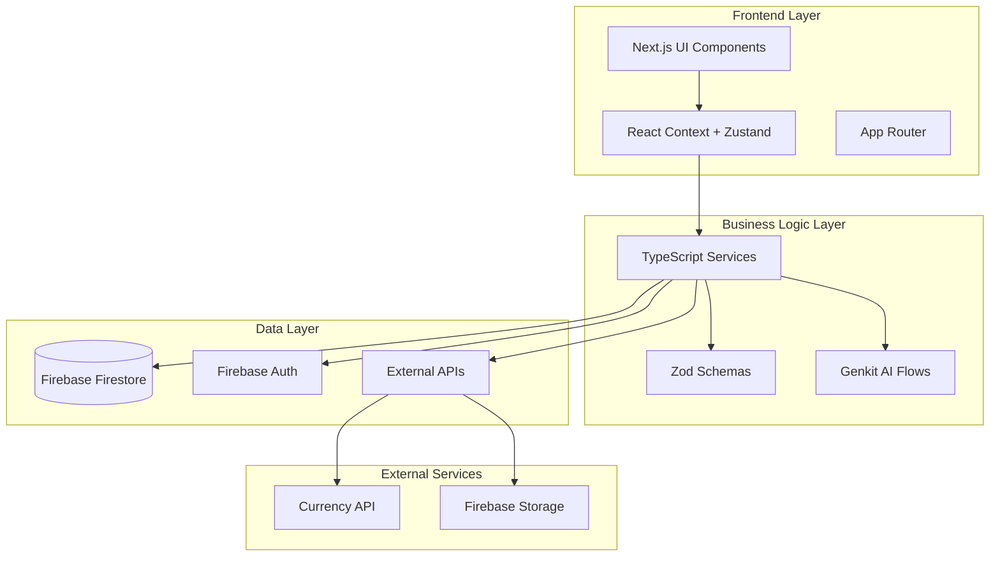
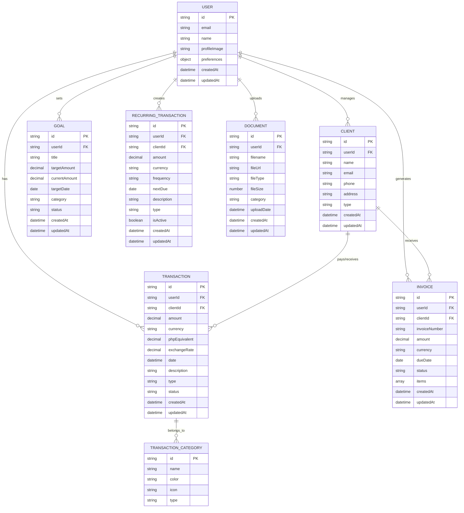
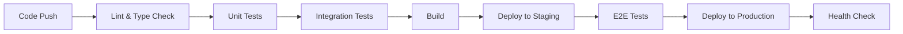
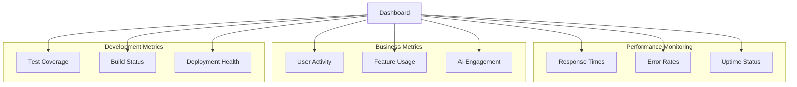

# Chaching Technical Specifications

## Executive Summary

This document outlines the technical specifications for Chaching, a comprehensive financial management platform built with Next.js, TypeScript, and Google Genkit AI. The system currently operates at 25% completion with critical needs for data persistence, authentication, and real-time currency integration.

**Key Metrics:**
- 30 user stories (147 story points total)
- 25% implementation completion
- Critical technical debt: No data persistence, mock data dependencies

## System Architecture

### High-Level Architecture



### Technology Stack

#### Core Technologies
- **Framework:** Next.js 14+ (App Router)
- **Language:** TypeScript (strict mode)
- **AI:** Google Genkit with Zod validation
- **Styling:** Tailwind CSS + shadcn/ui
- **Charts:** Recharts

#### Data & Authentication
- **Database:** Firebase Firestore (recommended)
- **Authentication:** Firebase Auth with JWT
- **File Storage:** Firebase Storage
- **State Management:** React Context API + Zustand

#### External Integrations
- **Currency API:** Real-time exchange rates
- **Payment Processing:** TBD (Stripe/PayPal)

## Data Architecture

### Entity Relationship Diagram



### Database Schema

#### Collections Structure (Firestore)

```typescript
// User Collection
interface User {
  id: string;
  email: string;
  name: string;
  profileImage?: string;
  preferences: {
    defaultCurrency: string;
    dateFormat: string;
    theme: 'light' | 'dark' | 'system';
    notifications: {
      email: boolean;
      push: boolean;
      weekly: boolean;
    };
  };
  createdAt: Timestamp;
  updatedAt: Timestamp;
}

// Transaction Collection
interface Transaction {
  id: string;
  userId: string;
  clientId?: string;
  amount: number;
  currency: string;
  phpEquivalent: number;
  exchangeRate: number;
  date: Timestamp;
  description: string;
  type: 'income' | 'expense';
  category: string;
  status: 'pending' | 'completed' | 'cancelled';
  metadata?: {
    invoiceId?: string;
    recurringId?: string;
    tags?: string[];
  };
  createdAt: Timestamp;
  updatedAt: Timestamp;
}

// Client Collection
interface Client {
  id: string;
  userId: string;
  name: string;
  email?: string;
  phone?: string;
  address?: string;
  type: 'individual' | 'business';
  totalEarned: number;
  totalOwed: number;
  createdAt: Timestamp;
  updatedAt: Timestamp;
}

// Goal Collection
interface Goal {
  id: string;
  userId: string;
  title: string;
  targetAmount: number;
  currentAmount: number;
  targetDate: Timestamp;
  category: string;
  status: 'active' | 'completed' | 'paused';
  description?: string;
  createdAt: Timestamp;
  updatedAt: Timestamp;
}
```

## API Specifications

### Service Layer Architecture

```typescript
// Transaction Service
interface TransactionService {
  create(transaction: CreateTransactionDto): Promise<Transaction>;
  findAll(userId: string, filters?: TransactionFilters): Promise<Transaction[]>;
  findById(id: string): Promise<Transaction | null>;
  update(id: string, updates: UpdateTransactionDto): Promise<Transaction>;
  delete(id: string): Promise<void>;
  getAnalytics(userId: string, period: DateRange): Promise<TransactionAnalytics>;
}

// Client Service
interface ClientService {
  create(client: CreateClientDto): Promise<Client>;
  findAll(userId: string): Promise<Client[]>;
  findById(id: string): Promise<Client | null>;
  update(id: string, updates: UpdateClientDto): Promise<Client>;
  delete(id: string): Promise<void>;
  getClientSummary(clientId: string): Promise<ClientSummary>;
}

// Currency Service
interface CurrencyService {
  getExchangeRate(from: string, to: string): Promise<number>;
  convertAmount(amount: number, from: string, to: string): Promise<number>;
  getSupportedCurrencies(): Promise<Currency[]>;
  updateRates(): Promise<void>;
}
```

### Data Transfer Objects (DTOs)

```typescript
// Transaction DTOs
interface CreateTransactionDto {
  clientId?: string;
  amount: number;
  currency: string;
  date: string;
  description: string;
  type: 'income' | 'expense';
  category: string;
}

interface UpdateTransactionDto {
  amount?: number;
  currency?: string;
  date?: string;
  description?: string;
  category?: string;
  status?: 'pending' | 'completed' | 'cancelled';
}

// Client DTOs
interface CreateClientDto {
  name: string;
  email?: string;
  phone?: string;
  address?: string;
  type: 'individual' | 'business';
}

interface UpdateClientDto {
  name?: string;
  email?: string;
  phone?: string;
  address?: string;
  type?: 'individual' | 'business';
}
```

## AI Integration Specifications

### Genkit Flow Architecture

```typescript
// Financial Insights Flow
interface FinancialInsightsFlow {
  input: {
    userId: string;
    transactions: Transaction[];
    dateRange: DateRange;
  };
  output: {
    insights: {
      summary: string;
      trends: Trend[];
      recommendations: Recommendation[];
      alerts: Alert[];
    };
    confidence: number;
  };
}

// Spending Anomaly Detection
interface AnomalyDetectionFlow {
  input: {
    userId: string;
    transactions: Transaction[];
    threshold: number;
  };
  output: {
    anomalies: {
      transaction: Transaction;
      reason: string;
      severity: 'low' | 'medium' | 'high';
      suggestion: string;
    }[];
  };
}

// Income Prediction Flow
interface IncomePredictionFlow {
  input: {
    userId: string;
    historicalData: Transaction[];
    predictionPeriod: 'week' | 'month' | 'quarter';
  };
  output: {
    prediction: {
      amount: number;
      confidence: number;
      breakdown: CategoryPrediction[];
    };
  };
}
```

### Zod Validation Schemas

```typescript
// Transaction Schemas
const CreateTransactionSchema = z.object({
  clientId: z.string().optional(),
  amount: z.number().positive(),
  currency: z.string().length(3),
  date: z.string().datetime(),
  description: z.string().min(1).max(255),
  type: z.enum(['income', 'expense']),
  category: z.string().min(1)
});

const TransactionFiltersSchema = z.object({
  startDate: z.string().datetime().optional(),
  endDate: z.string().datetime().optional(),
  type: z.enum(['income', 'expense']).optional(),
  category: z.string().optional(),
  clientId: z.string().optional(),
  minAmount: z.number().optional(),
  maxAmount: z.number().optional()
});
```

## Security Specifications

### Authentication & Authorization

```typescript
// Auth Middleware
interface AuthMiddleware {
  validateToken(token: string): Promise<DecodedToken>;
  requireAuth(): Middleware;
  requireOwnership(resourceType: string): Middleware;
}

// Permission System
interface Permission {
  resource: string;
  action: 'create' | 'read' | 'update' | 'delete';
  userId: string;
}

// Security Rules (Firestore)
const securityRules = `
rules_version = '2';
service cloud.firestore {
  match /databases/{database}/documents {
    // Users can only access their own data
    match /users/{userId} {
      allow read, write: if request.auth != null && request.auth.uid == userId;
    }
    
    // Transactions belong to authenticated users
    match /transactions/{transactionId} {
      allow read, write: if request.auth != null && 
        request.auth.uid == resource.data.userId;
    }
    
    // Clients belong to authenticated users
    match /clients/{clientId} {
      allow read, write: if request.auth != null && 
        request.auth.uid == resource.data.userId;
    }
  }
}
`;
```

### Data Validation & Sanitization

```typescript
// Input Sanitization
interface SanitizationService {
  sanitizeHtml(input: string): string;
  validateEmail(email: string): boolean;
  sanitizeFilename(filename: string): string;
  validateCurrency(currency: string): boolean;
}

// Rate Limiting
interface RateLimitConfig {
  windowMs: number;
  maxRequests: number;
  message: string;
  endpoints: {
    '/api/transactions': { max: 100, window: '15m' };
    '/api/ai/insights': { max: 10, window: '1h' };
  };
}
```

## Performance Specifications

### Optimization Strategies

#### Frontend Performance
- **Code Splitting:** Dynamic imports for AI flows and heavy components
- **Image Optimization:** Next.js Image component with WebP format
- **Caching:** React Query for API caching with 5-minute stale time
- **Bundle Size:** Target <250KB initial bundle

#### Backend Performance
- **Database Indexing:** Composite indexes on userId + date for transactions
- **Connection Pooling:** Firebase connection optimization
- **Caching Strategy:** Redis for frequently accessed data (exchange rates)

#### AI Performance
- **Model Optimization:** Cached embeddings for common financial terms
- **Batch Processing:** Group similar AI requests
- **Response Streaming:** Stream long AI responses

### Performance Metrics

```typescript
interface PerformanceTargets {
  pageLoad: {
    initial: '<3s';
    subsequent: '<1s';
  };
  api: {
    crud: '<500ms';
    ai: '<3s';
    analytics: '<2s';
  };
  database: {
    simpleQuery: '<100ms';
    complexQuery: '<500ms';
    writes: '<200ms';
  };
}
```

## Implementation Roadmap

### Phase 1: Foundation (Weeks 1-2) - 35 Story Points

#### Priority: Critical
1. **Database Setup** [8 points]
   - Configure Firebase Firestore
   - Implement security rules
   - Set up collections and indexes

2. **Authentication System** [8 points]
   - Firebase Auth integration
   - JWT token handling
   - Protected routes

3. **Core Services** [13 points]
   - Transaction service implementation
   - Client service implementation
   - Currency service with real-time API

4. **Data Migration** [6 points]
   - Migrate from mock data to Firestore
   - Preserve existing UI functionality
   - Implement error boundaries

### Phase 2: Core Features (Weeks 3-4) - 42 Story Points

#### Priority: High
1. **Transaction Management** [18 points]
   - CRUD operations with validation
   - Multi-currency support
   - Real-time exchange rates
   - Transaction categorization

2. **Client Management** [12 points]
   - Client CRUD operations
   - Client analytics
   - Transaction history per client

3. **Dashboard Enhancement** [12 points]
   - Real-time data integration
   - Performance optimization
   - Chart improvements

### Phase 3: Advanced Features (Weeks 5-6) - 35 Story Points

#### Priority: Medium
1. **AI Integration** [15 points]
   - Financial insights flow
   - Spending anomaly detection
   - Income prediction

2. **Goals & Planning** [10 points]
   - Goal tracking system
   - Progress visualization
   - Achievement notifications

3. **Document Management** [10 points]
   - File upload system
   - Document categorization
   - Search functionality

### Phase 4: Polish & Optimization (Weeks 7-8) - 35 Story Points

#### Priority: Low
1. **Advanced Analytics** [15 points]
   - Custom report generation
   - Export functionality
   - Trend analysis

2. **Integration Features** [10 points]
   - Bank account sync (future)
   - Payment gateway integration
   - API for third-party access

3. **User Experience** [10 points]
   - Advanced filtering
   - Bulk operations
   - Mobile optimization

## Testing Strategy

### Test Coverage Requirements

```typescript
interface TestingStrategy {
  unit: {
    target: '90%';
    framework: 'Jest + Testing Library';
    focus: 'Services, utilities, components';
  };
  integration: {
    target: '80%';
    framework: 'Jest + Supertest';
    focus: 'API endpoints, database operations';
  };
  e2e: {
    target: '70%';
    framework: 'Playwright';
    focus: 'Critical user flows';
  };
}
```

### Test Categories

#### Unit Tests
- Service layer functions
- Utility functions
- Component rendering
- Zod schema validation

#### Integration Tests
- API endpoint responses
- Database operations
- Authentication flows
- AI flow execution

#### End-to-End Tests
- User registration/login
- Transaction creation flow
- Dashboard navigation
- AI insights generation

## Deployment Specifications

### Environment Configuration

```typescript
interface EnvironmentConfig {
  development: {
    database: 'firestore-emulator';
    ai: 'genkit-dev';
    currency: 'mock-api';
  };
  staging: {
    database: 'firestore-staging';
    ai: 'genkit-staging';
    currency: 'exchangerate-api';
  };
  production: {
    database: 'firestore-prod';
    ai: 'genkit-prod';
    currency: 'exchangerate-api';
    monitoring: 'enabled';
  };
}
```

### CI/CD Pipeline



### Monitoring & Logging

```typescript
interface MonitoringConfig {
  performance: {
    pageSpeed: 'Google PageSpeed Insights';
    uptime: 'Firebase Monitoring';
    errors: 'Sentry';
  };
  analytics: {
    usage: 'Google Analytics 4';
    custom: 'Custom event tracking';
  };
  logging: {
    level: 'info' | 'warn' | 'error';
    aggregation: 'Firebase Logging';
    retention: '30 days';
  };
}
```

## Risk Assessment & Mitigation

### High-Risk Areas

#### 1. Data Migration Risk
- **Risk:** Data loss during mock-to-production migration
- **Mitigation:** Incremental migration with rollback capability
- **Testing:** Extensive backup and restore testing

#### 2. Currency API Dependency
- **Risk:** Exchange rate API failures or rate limits
- **Mitigation:** Multiple API providers, cached fallbacks
- **Monitoring:** API health checks and alerts

#### 3. AI Performance Risk
- **Risk:** Slow AI response times affecting UX
- **Mitigation:** Response streaming, cached insights
- **Fallback:** Basic analytics without AI

#### 4. Authentication Security Risk
- **Risk:** Token compromise or session hijacking
- **Mitigation:** Short-lived tokens, secure headers
- **Monitoring:** Suspicious activity detection

### Performance Risks

```typescript
interface PerformanceRisks {
  database: {
    risk: 'Query performance degradation with scale';
    mitigation: 'Proper indexing, query optimization';
    threshold: '500ms response time';
  };
  ai: {
    risk: 'AI service rate limiting';
    mitigation: 'Request queuing, batch processing';
    threshold: '5s response time';
  };
  frontend: {
    risk: 'Bundle size growth';
    mitigation: 'Code splitting, tree shaking';
    threshold: '250KB initial bundle';
  };
}
```

## Success Metrics

### Key Performance Indicators

```typescript
interface SuccessMetrics {
  technical: {
    uptime: '>99.5%';
    pageLoad: '<3s initial, <1s subsequent';
    apiResponse: '<500ms average';
    errorRate: '<1%';
  };
  business: {
    userRetention: '>80% monthly';
    featureAdoption: '>60% for core features';
    aiUsage: '>40% of users using AI insights';
  };
  development: {
    testCoverage: '>85% overall';
    buildTime: '<5 minutes';
    deploymentFrequency: 'Daily';
    changeFailureRate: '<10%';
  };
}
```

### Monitoring Dashboard



## Conclusion

This technical specification provides a comprehensive roadmap for implementing Chaching's remaining 75% functionality. The phased approach prioritizes critical infrastructure (data persistence, authentication) while building toward advanced AI-powered features.

**Next Steps:**
1. Review and approve technical architecture
2. Set up development environment with Firebase
3. Begin Phase 1 implementation starting with database setup
4. Establish monitoring and testing infrastructure

**Confidence Rating: 9/10**

The specification is based on thorough analysis of existing codebase, user requirements, and industry best practices. Implementation risk is low with proper execution of the phased approach.